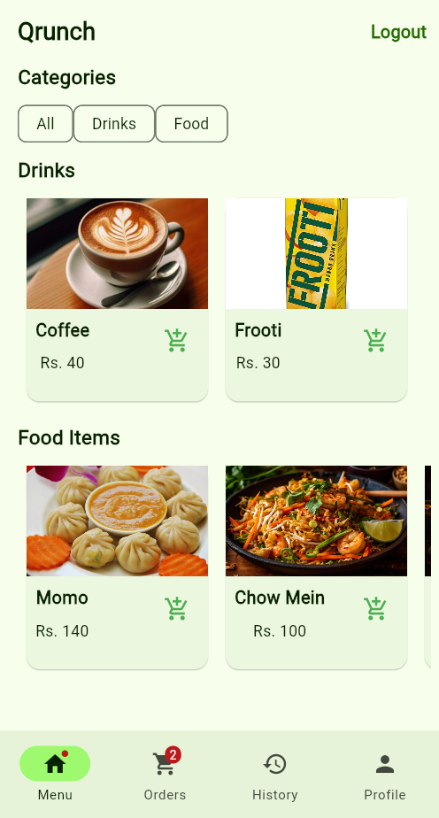
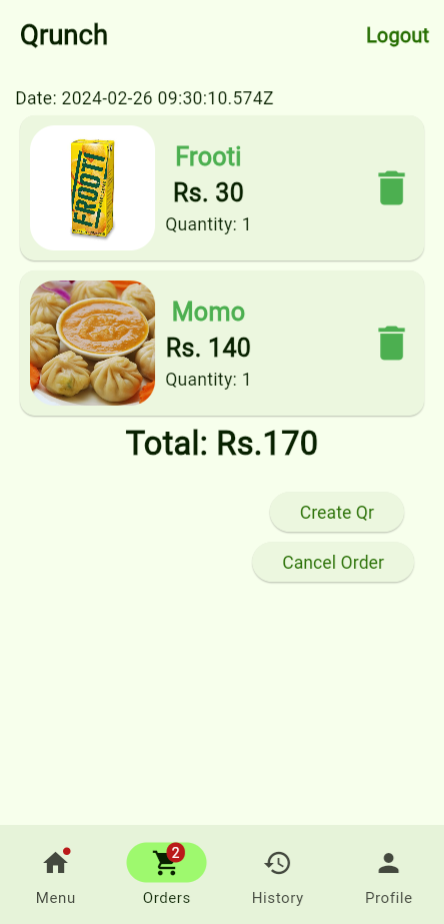
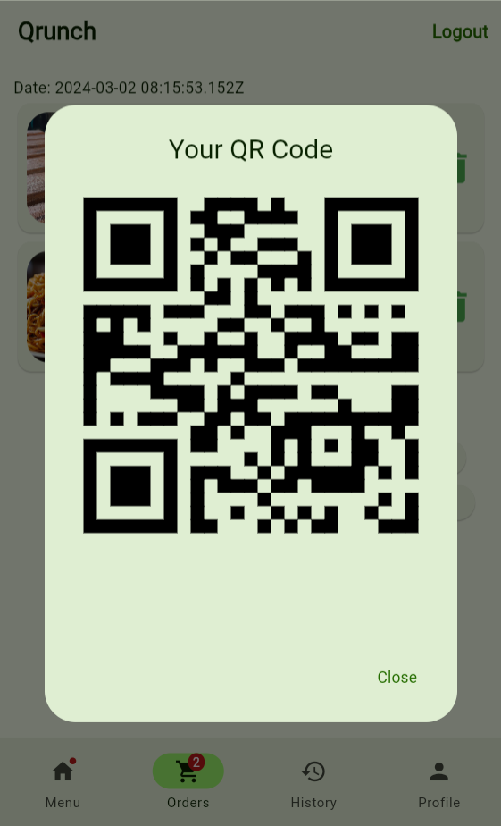
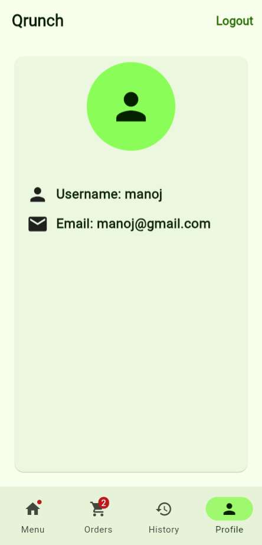
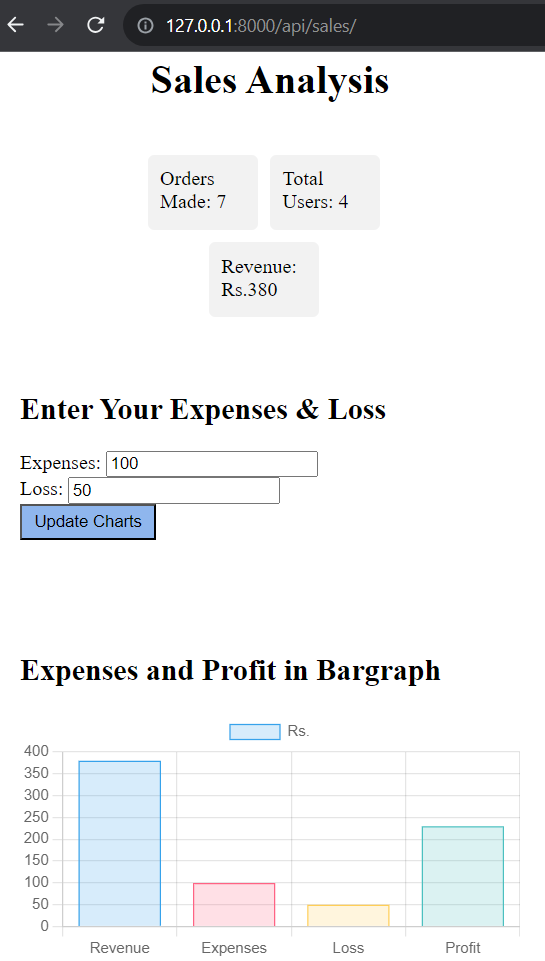

# QRUNCH (A QR Based Canteen Management App)
This is a QR based Canteen Management App designed as a part of minor project using Flutter and Django. Using this we can order food and snacks using a generated Quick Response(QR) code.

<<<<<<< HEAD

=======
>>>>>>> a58b958f6fb9f65b2391e410a86335a685a6c0d9
